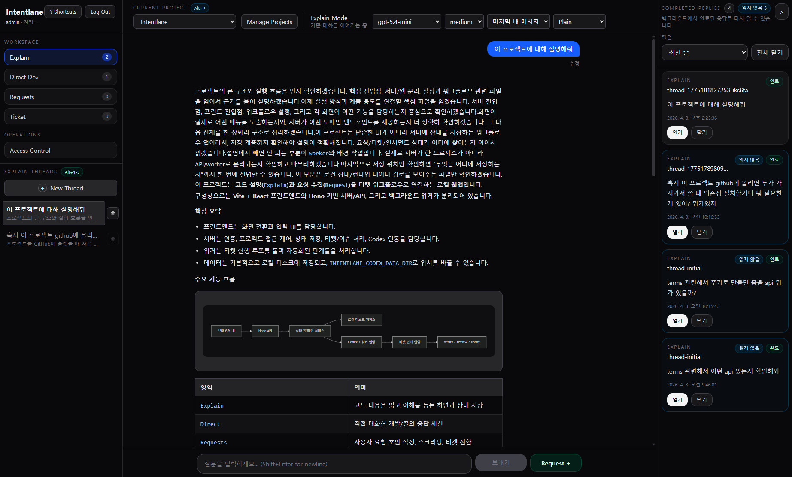
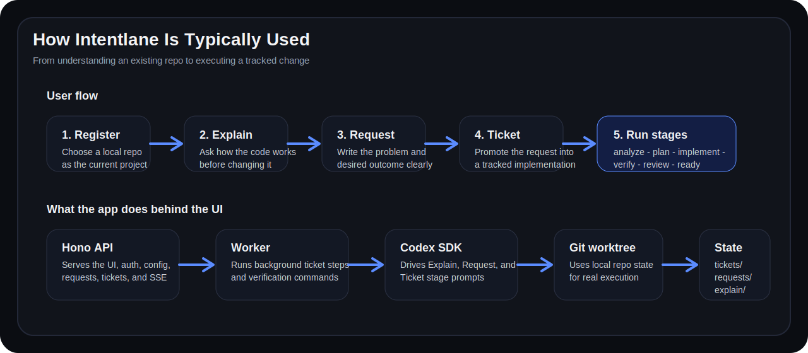
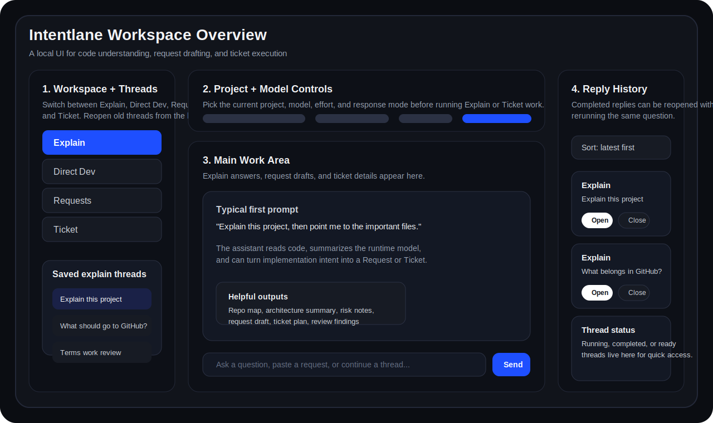

# Intentlane

한국어 | [English](./README.en.md)

`Intentlane`은 Codex SDK 기반 로컬 웹 워크스페이스다. 로컬 git 저장소를 읽어 `Explain`로 코드를 이해하고, `Requests`에서 요구사항을 정리한 뒤, `Ticket`에서 `analyze -> plan -> implement -> verify -> review -> ready` 흐름으로 실제 실행까지 이어준다.

정적 문서 뷰어가 아니라, 로컬 저장소를 직접 읽고 검증 명령과 `git worktree`를 실제로 사용하는 개발 작업 도구로 보는 편이 정확하다. Linux, macOS, Windows + WSL2 기준으로 쓸 수 있고, 기본 진입점은 웹 UI지만 작업의 실체는 로컬 저장소와 서버, worker, verification 명령에 있다.

바로 가기:

- [빠른 시작](#빠른-시작)
- [트러블슈팅](#트러블슈팅)
- [`intentlane-setup` skill](./.codex/skills/intentlane-setup/SKILL.md)
- [`AGENTS.md`](./AGENTS.md)
- [`flows.config.json`](./flows.config.json)

## Preferred Setup

이 저장소에는 fresh clone을 바로 실행 가능한 상태로 끌어올리는 [`intentlane-setup`](./.codex/skills/intentlane-setup/SKILL.md) 스킬이 이미 들어 있다. Codex에서 이 저장소를 열었다면, 수동으로 `.env`를 만지기 전에 이 경로를 먼저 쓰는 편이 가장 안전하다.

```text
Use $intentlane-setup to get this fresh clone running with pnpm dev, bootstrap root auth, and a safe .env.
```

```text
$intentlane-setup으로 이 저장소 fresh clone 세팅을 끝내줘. .env 생성, pnpm install, pnpm dev, health check, 첫 로그인 확인까지 해줘.
```

이 스킬은 기본적으로 실행 모드와 인증 방식을 확인하고, 안전한 `.env`를 만들고, `pnpm install`, `pnpm dev`, `/api/health`, bootstrap root 로그인까지 sanity check하는 흐름을 따른다.

## Highlights

- `Explain -> Requests -> Ticket` 흐름으로 코드 이해부터 실행 가능한 작업 추적까지 한 번에 이어진다.
- 로컬 git 저장소를 직접 읽고, 실제 `git worktree`와 verification 명령을 사용한다.
- `Access Control`로 계정, 세션, API token, 프로젝트 접근 권한을 관리할 수 있다.
- `Incidents`로 Ticket 실행 실패와 자동 복구 이슈를 추적할 수 있다.
- 런타임 상태를 파일 시스템에 보존해 Explain, Request, Ticket, Incident 기록을 로컬에 남긴다.

## How It Works (Short)

```text
Browser UI
  │
  ├─ Explain / Direct Dev / Requests / Ticket / Access Control
  │
  ▼
Hono API
  │
  ├─ auth + config + project selection
  ├─ explain/request/ticket routes
  ├─ SSE + runtime state persistence
  │
  ├──────────────┐
  ▼              ▼
Worker        Codex SDK
  │              │
  ├─ ticket runs │
  ├─ verification│
  └─ incidents   │
                 ▼
        local repo + git worktree + prompts/flows
                 ▼
     tickets/ requests/ incidents/ explain/ runtime.settings.json
```

## 한눈에 보기

### 현재 UI

<p align="center">
  
</p>
<p align="center">
  <sub>좌측 workspace/thread 목록, 상단 프로젝트/모델 설정, 중앙 작업 본문, 우측 완료된 reply 기록으로 구성된 현재 UI</sub>
</p>

| 하고 싶은 일 | 들어갈 화면 | 기대 결과 |
| --- | --- | --- |
| 현재 프로젝트 구조와 실행 흐름을 이해하고 싶다 | `Explain` | 구조 설명, 중요 파일, 영향 범위, 변경 지점 정리 |
| Request/Ticket 흐름과 별개로 바로 구현하거나 조사하고 싶다 | `Direct Dev` | 자유로운 개발 작업 세션 |
| 사용자 관점 요구사항을 먼저 또렷하게 적고 싶다 | `Requests` | `Problem`, `Desired Outcome`, `User Scenarios` 중심 초안 |
| 추적 가능한 구현 플로우로 실행하고 싶다 | `Ticket` | `analyze -> plan -> implement -> verify -> review -> ready` 단계 진행 |
| 계정, 세션, 토큰, 프로젝트 접근 권한을 관리하고 싶다 | `Access Control` | 운영용 계정/세션/API token 관리 |

### 추천 사용 순서

<p align="center">
  
</p>

처음 쓰는 사람은 아래 순서로 시작하면 된다.

1. 현재 작업할 로컬 저장소를 프로젝트로 등록하거나 선택한다.
2. `Explain`에서 코드 구조, 실행 흐름, 영향 범위를 먼저 이해한다.
3. 구현 의도가 선명해지면 `Requests`에 문제와 원하는 결과를 정리한다.
4. Request를 `Ticket`으로 올려 자동 단계 실행 흐름에 태운다.
5. 필요하면 `Access Control`에서 일반 사용자 계정, 세션, API token을 관리한다.

처음 질문 예시:

```text
이 프로젝트 구조와 실행 흐름을 먼저 설명해줘
이 변경이 들어갈 파일과 영향 범위를 짚어줘
이 요청을 Request 초안으로 정리해줘
이 Request를 Ticket으로 올리면 어떤 단계가 필요한지 설명해줘
```

### 화면 구조

<p align="center">
  
</p>

- 왼쪽 사이드바에서 `Explain`, `Direct Dev`, `Requests`, `Ticket`, `Access Control` 같은 화면을 바꾸고 저장된 thread를 다시 연다.
- 상단 컨트롤에서 현재 프로젝트, 모델, reasoning effort, 응답 모드를 바꾼다.
- 가운데 본문에서는 Explain 답변, Request 초안, Ticket 상세 내용과 단계 상태를 확인한다.
- 오른쪽 패널에서는 완료된 reply를 다시 열거나 최근 기록을 빠르게 훑을 수 있다.

## 이런 상황에 잘 맞는다

| 잘 맞는 경우 | 덜 맞는 경우 |
| --- | --- |
| 기존 로컬 저장소를 먼저 이해한 뒤 안전하게 변경하고 싶다 | 원격 SaaS에서 코드 업로드만으로 끝나는 hosted 도구를 원한다 |
| 요구사항을 `Request -> Ticket` 흐름으로 추적 가능하게 관리하고 싶다 | 단발성 채팅만 필요하고 상태 저장이나 추적은 필요 없다 |
| 실제 `git worktree`, 로컬 검증 명령, 파일 시스템 상태를 사용하는 개발 도구가 필요하다 | 브라우저 안에서만 모든 실행이 끝나는 도구를 기대한다 |
| 한 저장소를 여러 계정, 세션, 권한으로 운영하고 싶다 | 앱 로그인 없이 완전한 open access가 기본이길 기대한다 |
| 코드를 외부에 업로드하지 않고 현재 머신 컨텍스트에서 작업하고 싶다 | 현재 머신에 Codex/OpenAI 인증이나 `git`, `rg` 같은 로컬 의존성을 준비하기 어렵다 |

## 빠른 시작

### 준비물

- OS: Linux, macOS, Windows + WSL2
- Node.js: 권장 `20.19+` 또는 `22.12+`
- `pnpm@10.28.1`
- `git`
- `rg` (`ripgrep`)
- 로컬 Codex/OpenAI 인증 환경

`native Windows`는 이 저장소 기준으로 정식 보장하지 않는다.

준비되었는지 바로 확인하려면:

```bash
node -v
pnpm -v
git --version
rg --version
```

> 중요
> 이 앱은 서버 로그인 UI는 제공하지만, Codex/OpenAI 자체 로그인이나 API 키 발급을 대신하지 않는다. 앱 로그인과 Codex/OpenAI 인증은 별개다.

### 설치

```bash
git clone https://github.com/de-monkey-v/intentlane-codex.git
cd intentlane-codex
pnpm install
cp .env.example .env
```

공개 저장소에서 처음 받아 실행할 때는 `.env`를 복사한 뒤 최소한 `INTENTLANE_CODEX_BOOTSTRAP_ROOT_PASSWORD`를 실제 값으로 바꾸는 편이 안전하다.

### 최소 `.env`

가장 안전한 첫 실행 경로는 bootstrap root 관리자 계정이다.

```dotenv
HOST=0.0.0.0
PORT=4000

INTENTLANE_CODEX_BOOTSTRAP_ROOT_ENABLED=1
INTENTLANE_CODEX_BOOTSTRAP_ROOT_NAME=admin
INTENTLANE_CODEX_BOOTSTRAP_ROOT_PASSWORD=change-this-before-use
```

개발 데이터를 저장소 루트와 분리하려면 아래 값을 함께 두는 편이 좋다.

```dotenv
INTENTLANE_CODEX_DATA_DIR=.local/dev-data
```

### 실행 모드

| 모드 | 명령 | Web UI | API | 언제 쓰나 |
| --- | --- | --- | --- | --- |
| 개발 모드 | `pnpm dev` | `http://localhost:5173/` | `http://localhost:4000/` | 프론트엔드, API, worker를 함께 hot reload로 돌릴 때 |
| 로컬 배포형 실행 | `pnpm build && pnpm start` | `http://localhost:4000/` | `http://localhost:4000/` | 빌드된 웹 앱과 API를 같은 origin으로 확인할 때 |

`pnpm dev`는 아래 3개를 함께 띄운다.

- `pnpm dev:server`
- `pnpm dev:worker`
- `pnpm dev:web`

중요:

- `worker`가 없으면 ticket 자동 실행이 완전하게 돌지 않는다.
- `web`은 Vite dev server이고 `/api`를 `http://localhost:4000`으로 프록시한다.
- `pnpm start`는 내부적으로 API 프로세스와 worker 프로세스를 같이 띄운다.
- 빌드 전에 `pnpm start`만 실행하면 `Web assets not found. Run pnpm build first.` 응답이 나온다.

### 첫 브라우저 진입

1. `http://localhost:5173/` 또는 배포형 실행이면 `http://localhost:4000/`에 접속한다.
2. `admin`과 `.env`에 넣은 비밀번호로 로그인한다.
3. 비밀번호 변경 화면이 나오면 먼저 변경한다.
4. 필요하면 `http://localhost:4000/api/health`로 API 상태를 함께 확인한다.

### 첫 sanity check

Health 확인:

```bash
curl http://localhost:4000/api/health
```

예상 응답:

```json
{"status":"ok"}
```

로그인:

```bash
curl -X POST http://localhost:4000/api/access/login \
  -H 'Content-Type: application/json' \
  -d '{"name":"admin","password":"change-this-before-use"}'
```

예상 응답 형태:

```json
{
  "token": "<session-token>",
  "session": {
    "id": "ses_...",
    "accountName": "admin"
  }
}
```

설정 읽기:

```bash
TOKEN="<session-token>"

curl http://localhost:4000/api/config \
  -H "Authorization: Bearer $TOKEN"
```

이 응답에는 현재 세션 권한, 허용 프로젝트, Explain 모델 선택값, Ticket category 정보가 들어 있다.

### 첫 10분 워크플로

처음 설치 직후 실제로 해보면 좋은 흐름이다.

1. 프로젝트 선택창에서 현재 저장소를 선택하거나 새 로컬 저장소를 등록한다.
2. `Explain`에서 아래처럼 먼저 물어본다.

```text
이 프로젝트 구조와 실행 흐름을 먼저 설명해줘
중요한 서버 파일과 프론트엔드 진입점을 같이 짚어줘
```

3. 구현하고 싶은 내용이 있으면 `Requests`에 아래 형식으로 적는다.

```text
Problem
- 사용자가 어떤 문제를 겪는지

Desired Outcome
- 사용 후 무엇이 달라져야 하는지

User Scenarios
- 대표 사용자 흐름 2~3개
```

4. Request를 `Ticket`으로 올리고 category를 고른다.
5. `analyze -> plan -> implement -> verify -> review -> ready` 단계를 확인한다.
6. 실패가 나면 `Incidents` 또는 검증 출력부터 본다.

## 인증과 보안

> 중요
> 서버 로그인 인증과 Codex/OpenAI 인증은 다른 계층이다. 앱에 로그인했더라도 현재 머신에서 Codex/OpenAI 인증이 아직 안 되어 있으면 `Explain`, `Direct Dev`, `Ticket` 실행은 실패할 수 있다.

기본 원칙은 아래와 같다.

- 인증 설정이 전혀 없으면 서버는 기본적으로 시작되지 않는다.
- 예외적으로 `INTENTLANE_CODEX_ALLOW_OPEN_ACCESS=1`을 두면 로컬 개발용 open access로 띄울 수 있다.
- 공유 환경에서는 open access를 쓰지 않는 것이 맞다.

권장 첫 실행 순서:

1. `.env`에 bootstrap root 계정 정보를 넣는다.
2. `pnpm dev` 또는 `pnpm start`로 서버를 띄운다.
3. 브라우저에서 root 계정으로 로그인한다.
4. 비밀번호 변경이 요구되면 먼저 바꾼다.
5. `Access Control` 화면에서 일반 사용자 계정이나 토큰을 만든다.

### `APP_SHARED_TOKEN`에 대한 주의

`APP_SHARED_TOKEN`은 지원되지만, 기본 브라우저 로그인 화면은 bearer token 입력 UI를 제공하지 않는다.

- `APP_SHARED_TOKEN`만 설정해 두고 일반 브라우저 로그인 흐름을 기대하면 막힐 수 있다.
- 이 값은 API 클라이언트, 자동화, 고급 운영 경로에 더 가깝다.
- 브라우저에서 정상적인 첫 진입을 하려면 bootstrap root 계정 방식이 가장 단순하다.

인증 적용 후 공개 경로:

- `/api/health`
- `/api/access/login`

비밀번호 변경 강제 상태에서 추가 허용 경로:

- `/api/config`
- `/api/access/logout`
- `/api/access/me/password`

## Product Mental Model

이 앱을 이해할 때 가장 중요한 구분은 아래 한 줄이다.

> `Request`는 무엇을 원하는지 정리하고, `Ticket`은 그것을 어떻게 만들지 실행한다.

### `Requests` vs `Ticket`

| 구분 | `Requests` | `Ticket` |
| --- | --- | --- |
| 목적 | 사용자 관점 요구사항을 또렷하게 정리 | 실행 가능한 기술 워크플로로 전환 |
| 중심 내용 | `Problem`, `Desired Outcome`, `User Scenarios` | 분석, 계획, 구현, 검증, 리뷰 |
| 주 사용 시점 | 구현 전에 요구사항을 먼저 다듬을 때 | 실제 변경을 추적 가능하게 실행할 때 |
| 결과물 | 승격 가능한 request 초안 | 단계별 상태와 산출물이 있는 ticket |

### 화면 모드 가이드

| 화면 | 언제 쓰나 | 비고 |
| --- | --- | --- |
| `Explain` | 코드베이스 구조와 실행 흐름, 영향 범위를 먼저 이해할 때 | 구현 요청처럼 보이는 입력은 Request draft로 넘길 수 있다 |
| `Direct Dev` | Explain보다 자유롭게 구현/조사 중심 대화를 하고 싶을 때 | Request/Ticket 흐름과 별개로 즉시 실무 작업을 밀어붙일 수 있다 |
| `Requests` | 사용자 관점 요구사항을 저장하고 다듬을 때 | 충분히 선명해지면 Ticket으로 승격한다 |
| `Ticket` | 추적 가능한 기술 실행 플로우가 필요할 때 | 기본 단계는 `analyze -> plan -> implement -> verify -> review -> ready`다. `docs` category는 `verify` 없이 간다 |
| `Incidents` | Ticket 실행 중 생긴 실패, 자동 복구 이슈를 확인할 때 | 주로 tickets 권한이 있는 사용자가 본다 |
| `Access Control` | 계정, 세션, API token, 프로젝트 접근 범위를 관리할 때 | 관리자 전용 운영 화면이다 |

### Ticket category 가이드

현재 기본 category는 아래와 같다.

| category | 언제 쓰나 | 단계 |
| --- | --- | --- |
| `feature` | 새 기능 추가 | `analyze -> plan -> implement -> verify -> review -> ready` |
| `bugfix` | 버그 수정과 회귀 검증 | `analyze -> plan -> implement -> verify -> review -> ready` |
| `change` | 기존 기능 변경 | `analyze -> plan -> implement -> verify -> review -> ready` |
| `docs` | 문서 작업 | `analyze -> plan -> implement -> review -> ready` |

기본 verification 명령은 현재 프로젝트의 `flows.config.json`에 정의된 `pnpm typecheck`, `pnpm test`, `pnpm build`다.

## 실행 모델

이 프로젝트는 정적 사이트가 아니라 `로컬 저장소를 직접 읽고 다루는 서버`다.

- 서버는 로컬 git 저장소를 직접 읽는다.
- Ticket 구현 단계에서는 `git worktree`를 사용한다.
- 기본 verification 명령은 로컬에서 실제 실행된다.
- 저장소 검색에는 `ripgrep (rg)`가 필요하다.
- 상태는 파일 시스템에 저장된다.

### 프로젝트 등록과 기본 프로젝트

- `flows.config.json`의 `defaultProjectId`는 `intentlane-codex`다.
- 처음 실행하면 이 저장소 자체를 기본 프로젝트로 사용한다.
- 다른 로컬 저장소는 runtime project로 추가 등록할 수 있다.
- WSL이나 headless 환경에서 네이티브 폴더 picker가 실패하면 수동 경로 입력을 쓰면 된다.

### 런타임 상태 저장

| 경로 | 의미 |
| --- | --- |
| `tickets/` | ticket 상태와 단계 산출물 |
| `client-requests/` | request 초안과 사용자 요구사항 저장 |
| `incidents/` | 실행 실패 및 복구 관련 incident 기록 |
| `background-runs/` | 백그라운드 실행 상태 |
| `explain/` | Explain 세션 상태 |
| `direct-sessions/` | Direct Dev 세션 상태 |
| `access-control.json` | 계정/세션/token 관련 접근 제어 상태 |
| `runtime.settings.json` | 런타임 프로젝트/모델 설정 |

중요:

- 위 파일들은 소스 코드가 아니라 런타임 상태다.
- 직접 hand-edit하기보다 앱 동작으로 생성되게 두는 편이 안전하다.
- 개발, 테스트, 운영 데이터를 분리하려면 `INTENTLANE_CODEX_DATA_DIR`를 쓰는 것이 맞다.

### 코드 레이어 요약

| 레이어 | 경로 | 역할 |
| --- | --- | --- |
| 프론트엔드 | `src/web` | Vite + React UI, 사용자 상호작용, API 호출 |
| API 라우트 | `src/server/routes` | 얇은 HTTP/SSE 진입점 |
| 서비스 | `src/server/services` | 비즈니스 로직, orchestration, persistence |
| 서버 유틸 | `src/server/lib` | 설정, 인증, 프로젝트, 경로, 모델 capability |
| 워커 | `src/server/worker.ts` | 백그라운드 ticket 단계 실행 |
| 제품 동작 설정 | `flows.config.json`, `prompts/` | Explain/Request/Ticket 흐름과 프롬프트 정의 |

문제 원인을 찾을 때는 보통 `routes -> services -> lib` 순서보다, `화면 증상 -> 해당 서비스 -> flows/prompts/config` 순서로 보는 편이 빠르다.

## 트러블슈팅

| 증상 | 먼저 볼 것 | 보통 원인 |
| --- | --- | --- |
| 로그인은 되는데 `Explain`이나 `Ticket`이 실패한다 | 현재 머신의 Codex/OpenAI 인증 상태 | 앱 로그인과 모델 실행 인증이 별개다 |
| 서버가 아예 시작되지 않는다 | `.env`의 인증 설정 | bootstrap root, `APP_SHARED_TOKEN`, 또는 로컬 개발용 open access 중 아무 것도 없을 수 있다 |
| Ticket이 진행되지 않고 멈춘다 | `worker` 실행 여부 | `pnpm dev:worker`, `pnpm dev`, `pnpm start` 중 worker가 없을 수 있다 |
| 프로젝트 폴더 선택이 실패한다 | 수동 경로 입력 | WSL/headless 환경에서는 네이티브 폴더 picker가 실패할 수 있다 |
| 저장소 읽기/검색이 실패한다 | `rg --version` | 서버 호스트에 `ripgrep (rg)`가 없을 수 있다 |
| `pnpm start`에서 웹 화면이 안 뜬다 | `pnpm build` 실행 여부 | 빌드 자산이 없어 `Web assets not found. Run pnpm build first.` 상태일 수 있다 |
| 예전 테스트 데이터와 현재 실행이 섞인다 | `INTENTLANE_CODEX_DATA_DIR` | 런타임 상태 저장 루트를 분리하지 않았을 수 있다 |

추가 팁:

- `docs` category는 기본적으로 `verify` 단계가 없다. 문서 변경인데 검증 단계가 보이지 않는다면 정상일 수 있다.
- verification 실패는 오케스트레이터 문제보다 실제 저장소 테스트 실패인 경우가 많다. `pnpm typecheck`, `pnpm test`, `pnpm build`를 로컬에서 그대로 재현해 보는 편이 빠르다.
- runtime 상태 파일은 직접 수정하기보다 문제를 재현하고 서비스, 설정 쪽을 고치는 편이 안전하다.

## 환경 변수

`.env.example`이 기본 템플릿이다. `pnpm dev`, `pnpm dev:server`, `pnpm dev:worker`, `pnpm start`는 루트 `.env`를 자동 로드한다.

| 이름 | 기본값 또는 예시 | 용도 |
| --- | --- | --- |
| `HOST` | `0.0.0.0` | API 및 배포형 앱 바인딩 호스트 |
| `PORT` | `4000` | API 및 배포형 앱 포트 |
| `INTENTLANE_CODEX_BOOTSTRAP_ROOT_ENABLED` | `1` | 첫 기동 시 root admin 자동 생성 |
| `INTENTLANE_CODEX_BOOTSTRAP_ROOT_NAME` | `admin` | bootstrap할 관리자 계정 이름 |
| `INTENTLANE_CODEX_BOOTSTRAP_ROOT_PASSWORD` | 직접 지정 | bootstrap 관리자 비밀번호 |
| `INTENTLANE_CODEX_DATA_DIR` | `.local/dev-data` 같은 경로 | 런타임 상태 저장 루트 분리 |
| `APP_ALLOWED_ORIGINS` | 비워둠 | 별도 origin의 웹 UI를 붙일 때만 CORS 허용 |
| `APP_SHARED_TOKEN` | 비워둠 | 공용 관리자 bearer token |
| `INTENTLANE_CODEX_RUNTIME_SETTINGS_PATH` | 비워둠 | runtime project/model 설정 파일 경로 override |
| `INTENTLANE_CODEX_ALLOW_OPEN_ACCESS` | 비워둠 | 로컬 개발 전용 open access escape hatch |

## 주요 명령

모든 명령은 저장소 루트에서 실행한다.

| 명령 | 용도 |
| --- | --- |
| `pnpm dev` | API watcher, worker watcher, Vite web dev server를 함께 실행 |
| `pnpm dev:server` | `src/server/api.ts` 감시 실행 |
| `pnpm dev:worker` | `src/server/worker.ts` 감시 실행 |
| `pnpm dev:web` | Vite 프론트엔드 실행 |
| `pnpm typecheck` | strict TypeScript 타입 검사 |
| `pnpm test` | `scripts/run-server-tests.mjs`를 통한 서버 테스트 실행 |
| `pnpm build` | `vite build && tsc -p tsconfig.server.json` |
| `pnpm start` | 빌드된 서버 진입점 `dist/server/index.js` 실행 |

단일 서버 테스트 파일 실행 예시:

```bash
tmpdir=$(mktemp -d) && INTENTLANE_CODEX_DATA_DIR="$tmpdir" INTENTLANE_CODEX_SKIP_ENV_FILE=1 node --import tsx --test src/server/tests/app.test.ts; status=$?; rm -rf "$tmpdir"; exit $status
```

## 검증 기대값

기본 verification 명령은 현재 기본 프로젝트 기준으로 아래 3개다.

- `pnpm typecheck`
- `pnpm test`
- `pnpm build`

변경 종류별 최소 기대값:

| 변경 종류 | 최소 권장 검증 |
| --- | --- |
| 서버 route, service, lib, MCP 변경 | `pnpm typecheck`, `pnpm test` |
| flow config 또는 prompt 변경 | `pnpm typecheck`, `pnpm test`, orchestration 가정 재검토 |
| UI 전용 변경 | 가장 가까운 검증 경로 + 가능하면 화면 확인 |
| build 또는 runtime wiring 변경 | `pnpm build` 포함 |

happy path만 보지 말고 실패 경로도 같이 확인하는 편이 맞다.

## LLM Agent Repo Map

<details>
<summary>펼쳐서 보기</summary>

이 저장소를 읽을 때 먼저 보면 좋은 경로는 아래다.

| 경로 | 왜 먼저 보나 |
| --- | --- |
| `AGENTS.md` | 이 저장소에서 지켜야 할 작업 규약 |
| `flows.config.json` | 프로젝트 목록, verification 명령, Explain, Request, Ticket 흐름 설정 |
| `prompts/` | Explain, Request, Ticket 단계 프롬프트 |
| `src/web` | Vite + React UI 진입점 |
| `src/web/components` | 주요 화면 컴포넌트 |
| `src/web/lib/api.ts` | 브라우저 API 클라이언트와 public payload 타입 |
| `src/server/routes` | 얇은 HTTP/SSE 진입점 |
| `src/server/services` | 실제 비즈니스 로직과 orchestration |
| `src/server/lib` | 설정, 인증, 프로젝트, 런타임 경로, 모델 capability 같은 기반 유틸 |

이 프로젝트에서는 `flows.config.json`과 `prompts/`를 단순 설정이 아니라 제품 동작의 일부로 봐야 한다.

</details>

## Request 작성 규칙

좋은 Request는 사용자 관점으로 아래를 분명히 적는다.

| 포함하면 좋은 내용 | 의미 |
| --- | --- |
| `Problem` | 왜 이 변경이 필요한가 |
| `Desired Outcome` | 사용자 입장에서 어떤 결과를 원하는가 |
| `User Scenarios` | 대표 사용자 흐름이 무엇인가 |
| `Constraints` | 구현 시 지켜야 하는 제약 |
| `Non-goals` | 이번 작업에서 하지 않을 것 |
| `Open Questions` | 아직 결정되지 않은 부분 |

피하는 편이 좋은 내용:

- 어떤 파일을 수정해야 하는지
- 어떤 함수명이나 클래스명을 써야 하는지
- 어떤 검증 명령을 돌릴지

그런 기술 세부사항은 Ticket 단계에서 다루는 것이 맞다.

## 유지보수 메모

<details>
<summary>펼쳐서 보기</summary>

기본 verification 명령은 `flows.config.json`에 정의되어 있다.

- `pnpm typecheck`
- `pnpm test`
- `pnpm build`

`Explain` 모델 목록은 서버에서 정적으로 관리한다. 모델 갱신 시에는 아래를 같이 본다.

1. `~/.codex/models_cache.json`
2. `src/server/lib/model-capabilities.ts`
3. `flows.config.json`
4. 관련 테스트 기대값

보조 링크:

- Models docs: <https://developers.openai.com/api/docs/models>
- Latest model guide: <https://platform.openai.com/docs/guides/latest-model>

</details>
